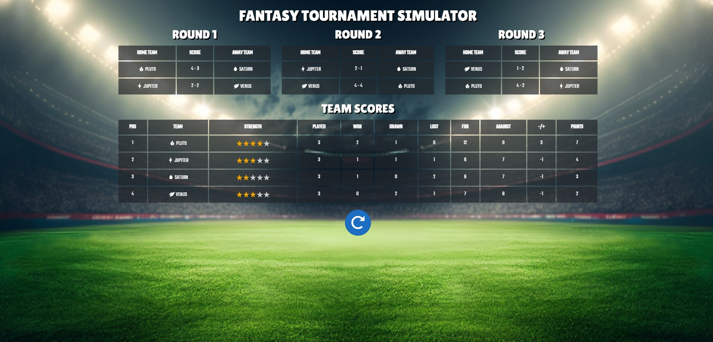

# Fantasy Tournament Simulator
## Some FYI's
This project is a tournament group stage simulator that simulates a soccer group stage progression consisting of 3 rounds and 4 teams.

> The rounds and teams are set to 3 rounds and 4 teams by default, but these are actually configurable in the `appsettings.json`!

The result of the group stage will be displayed in a table sorted based on the following criteria:
1.  Points
2.  Goal difference
3.  Goals for
4.  Goals against

> In this simulation, the team with a higher strength will more likely succeed in scoring, but the amount of goals will be randomly decided

The backend is based on C# .NET 6, whereas the frontend is based Blazor. 

> *Small question: Why Blazor?*
>
> Simply because it seemed fun to work with something new and to gain some experience with it!

## How to run
### Method 1
1. Download the file `Executable app.zip` and extract the contents to a folder
2. Run the file `MiniSimulator.BlazorServer.exe` -> This will open a new Command prompt
3. Copy the generated link in the prompt, e.g. https://localhost:5001/
4. Go to the link in the browser -> this will open the Fantasy Tournament Simulator
5. Start the simulation!

### Method 2
1. Open the `MiniSimulator.sln` in Visual Studio
2. Right click on `3. Apps -> MiniSimulator.BlazorServer` project and select `Set as Startup Project`
3. From the 2nd top bar, either select `MiniSimulator.BlazorServer` or `Docker` *(Docker Desktop app required\*)* as Launch Profile 
4. This will launch a new browser window with the Fantasy Tournament Simulator
5. Start the simulation!

## More tech stuff background
- The app is separated into three layers (with explanation next to it):
-- Domain - to keep the models/contracts and its design decoupled - adds possibility to easily have this consumed by other projects
-- Business - everything core business logic related - consumable by the apps - can be a Blazor app, API service, gRPC, Android etc.
-- App - everything related to the front-end -> possibly having multiple front-end solutions
- Enabled code analyzers to alert on code formatting etc
- Prepped the simulation methods with Task to make it async ready when more complicated calculations need to be done
- Used record types for models for immutability and to keep the models simple, keeping business logic outside of the models itself
- Added css compilation from sass to make life a bit easier when defining the styling

## Remaining notes
If I had more time, I would include these features/improvements as well (which I can think of at the moment):
- Implement knockout stage advancement simulation
- Add head to head sorting to determine the knockout team advancement
- Implement a more realistic algorithm to decide on the winning team
- Implement caching/data storage to remember the simulation
- Make the teams feed configurable through the frontend
- Make the rounds configurable through the frontend
- Decouple the Models and Settings object references with internal/external objects
- Implement AutoMapper for the internal/external objects
- Improve the frontend, also focus more on device friendliness